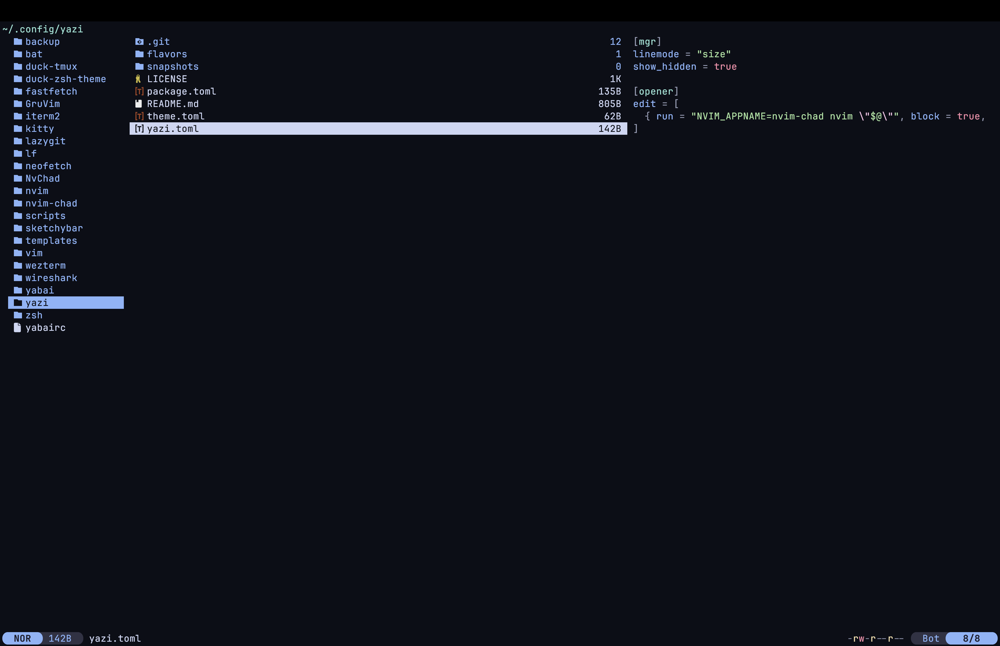

# duck-yazi
My personal configuration for [yazi](https://yazi-rs.github.io/) file explorer.

## Table of Contents
- [Getting Started](#getting-started)
    - [Requirements](#requirements)
    - [Installation](#installation)
- [Showcase](#showcase)

## Getting Started
This section will guide you through the process of installing **duck-yazi**.

### Requirements
* [yazi](https://yazi-rs.github.io/) file explorer.

### Installation
After you have met the requirements, proceed to follow the installation steps for **duck-yazi**.

1) After you have installed **yazi**, install the theme using the following command:
```sh
ya pkg add yazi-rs/flavors:catppuccin-mocha
```

> [!NOTE]
> I am using [catppuccin's mocha flavour](https://github.com/yazi-rs/flavors/tree/main/catppuccin-mocha.yazi).

## Showcase

